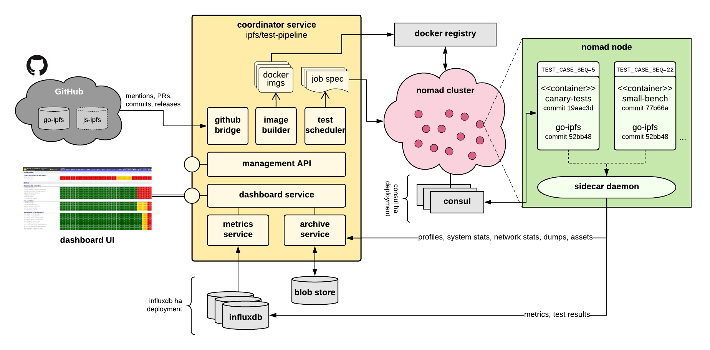

# IPFS test infrastructure design v1

<!-- START doctoc -->
<!-- END doctoc -->

## Goal

To provide a scalable runtime environment for the execution of various types of tests and benchmarks, written in different languages, by different teams, targeting a specific commit of go-ipfs or js-ipfs, and quantifying its characteristics in terms of performance, resource and network utilisation, stability, interoperability, etc., when compared to other commits.

The test pipeline should be tightly integrated with the software engineering practices and tooling the IPFS teams use (mostly GitHub), and must present results in a visual dashboard.

## Types of tests

We envision the following types of tests:

*   Small-scale benchmarks.
*   Canary tests against production.
*   Reproducible network tests.
*   Nightly bootstrapper deployments.
*   Nightly gateway deployments.
*   Sharness tests.
*   IPFS interoperability tests (go-ipfs >< js-ipfs)
*   libp2p interoperability tests (go-libp2p >< rust-libp2p >< js-libp2p >< …)
*   Package managers benchmarks (planned; undefined).
*   IPFS cluster testing (planned; undefined).

## System design

The following diagram illustrates the proposed system architecture.

Throughout this document, we use the term “service” in the sense of _domain driven design_. A service encapsulates a _logical, loosely coupled unit of the system, with a clearly delineated responsibility and function_. **A service does not translate to a separate process/binary;** instead the coordinator service will be a single binary, hosting and nesting all other services within it.

In the next sections, we’ll first provide an overview of the core concepts, to then proceed to describe each component individually, documenting its responsibility, technology, and how it interacts and integrates with the rest of the system.

This architecture proposed herein is versatile. It revolves around a **normalised test execution environment** that can accommodate, drive and leverage any kind of testing logic against go-ipfs or js-ipfs, and in the future libp2p implementations.

While this approach has numerous strengths, arguably the key benefit is that teams are free to write tests however they want, trusting that the environment will inject the right version of IPFS under test, and will capture metrics, results and other outputs as long as they comply with the simple contract.

Moreover, this design can trivially integrate **existing test harnesses** such as Sharness tests, JS Benchmarks, etc. **into a unified IPFS test pipeline**, as long as they can run on a Docker container (which is the case for all our existing harnesses).

### Overview

_Legend: **new concept introduced**_

This **testing infrastructure** will run the **IPFS test pipeline**. In the future it will power the libp2p test pipeline too.

The **IPFS test pipeline** is a collection of various batteries of tests that exercise IPFS in various manners. They capture metrics, logs, profiles, and other valuable data, to help engineers understand how the performance, stability and reliability of the system vary across commits.

Some test scenarios are small-scale (from 0-5 nodes) and local coordination suffices. Other test scenarios are larger scale (we eventually aspire to test 100,000 nodes), and thus required distributed coordination.

For this reason, the testing infrastructure we define here is cloud-native and largely reliant on the Hashicorp suite:

1. We use Nomad for workload orchestration.
2. Besides Nomad’s implicit use of Consul, we use it for coordination and synchronization when running distributed test cases.
3. Terraform (via the infrastructure team) to manage the deployment.

The **IPFS test pipeline** is composed of various **test plans**, each of which subjects IPFS to a different testing strategy. See types of tests above.

**Test plans** comprise **test cases**: concrete use cases that we wish to reproduce consistently over time, in order to capture fluctuations in the observed behaviour.

Each **test plan** is a world of its own. **Test plans** will be written, owned and maintained by distinct teams and working groups.

**Test plans** may be written in Go, JS, shell script, or anything else. Language, library choices and testing methodology must be opaque to the test infrastructure and pipeline. Test plans effectively behave like black boxes. A test plan satisfies a contract. It relies on an environment to be injected, executes its custom testing logic, and produces outputs in a predefined manner.

Triggered by GitHub automation, manual action, or a schedule (e.g. nightly), the test pipeline will:

1. Check out a specific commit of go-ipfs and js-ipfs (although our immediate priority is go-ipfs). We call these **test targets**.
2. Build it if necessary.
3. Schedule test plans to be run against it.

We call each run of the test plans a **test run.** Runs are identified by an auto-incrementing ordinal. A given commit xyz could be tested many times, across runs N1, N2, N3, etc. Performing the above steps steps is the responsibility of the **test scheduler** component.

For each test plan, the test runtime _promises_ to:

1. Deliver a **concrete set of inputs** via env variables, following [12-factor](https://12factor.net/config) principles.
2. **Collect and process its output** (stdout): metric recordings, test execution results, binary assets to be archived.

**Test plans** are _executable_ programs in their own. They expose a single entrypoint that multiplexes all inner test cases. This has the nice property of making test plans locally usable and testable -- without relying on a cluster being available.

Children test cases are identified by sequential ordinals in the range \[0, ∞). The entrypoint must dispatch to the appropriate **test case** based on an environment variable (TEST_CASE_SEQ).

The **test scheduler** will execute the **test plan** repeatedly, as many times as test cases it contains, incrementing the value of the variable each time. This will be accomplished by submitting one job per test case to Nomad, setting the TEST_CASE_SEQ value in the job spec.

Each **test plan** will own a _prototype_ [Nomad job HCL](https://www.nomadproject.io/docs/job-specification/index.html). At scheduling time, each test case will receive a callback to have an opportunity to mutate its HCL _(visitor design pattern)_. For example:

1. if a test case spawns 5 IPFS nodes, it may want to increment its resource quotas, if any are being set
2. if the test case is targeting a constrained environment, it could choke its resource quotas in the HCL.

Each **test plan** will be built as a standalone Docker image, layered on top of the base image of the **test target** (e.g. commit XYZ of go-ipfs). Using Docker containers enables us to:

1. Minimise environment dependencies by shipping self-contained workloads.
2. Isolate workloads from one another.
3. Limit the resources available to each test case.
4. Distribute test cases efficiently for execution across a cluster.
5. Apply networking policies to each test case going forward.
6. Most importantly: it keeps the layering of test plans on top of test targets clean and organised, via Docker layering, benefitting from cache.

The following diagram depicts the hierarchy:

These images will be published in a **private Docker registry**.

A single test case container may run multiple IPFS processes. Think of these containers as isolated IPTB deployments, creating N nodes and orchestrating them in a predefined manner.

By using the [“List processes running inside a container”](https://docs.docker.com/engine/api/v1.24/#list-processes-running-inside-a-container) Docker API endpoint, the test runtime can introspect how many IPFS instances a test case has launched.

### Test case runtime environment

To enable opacity of the inner mechanics of a test case, we define an agnostic, barebones formal execution environment that enables us to feed configuration parameters to the test case, and read out metrics, test results, and assets out of it, once it finishes running.

#### Inputs

Besides the environment variables supplied by Nomad and Docker, the test runtime will inform these environment variables to the test plan executable. This list is non comprehensive:

<table>
  <tr>
   <td>TEST_CASE_SEQ
   </td>
   <td>the sequence number of the test case to run within the test plan
   </td>
  </tr>
  <tr>
   <td>TEST_PLAN
   </td>
   <td>the name of the test plan
   </td>
  </tr>
  <tr>
   <td>TEST_BRANCH
   </td>
   <td>the branch that’s being tested; or “” if this is a dangling commit
   </td>
  </tr>
  <tr>
   <td>TEST_TAG
   </td>
   <td>the tag name that’s being tested; or “” if the commit is untagged
   </td>
  </tr>
  <tr>
   <td>TEST_REPO
   </td>
   <td>the git URL of the upstream repo
   </td>
  </tr>
  <tr>
   <td>TEST_COMMIT
   </td>
   <td>the SHA-1 of the commit under test
   </td>
  </tr>
  <tr>
   <td>TEST_RUN
   </td>
   <td>the test run number
   </td>
  </tr>
</table>

**Mounts:** `/output` will be mounted for the container to write assets it wants saved and archived under that test run (e.g. logs, outputs, files, etc.) Only assets linked to from an `asset` event will be collected.

#### Outputs

The test case must generate a stream of [ndjson](http://ndjson.org/) events on stdout. At this time, we support three types of **events**:

*   **metric:** records a quantifiable observation, attaching a metric name, unit, improvement direction, timestamp, value.
    *   The context (test case, test plan, run number) are encoded in the environment variables, so it would be superfluous to record them.
*   **result:** records a test success, failure or skip.
*   **asset:** enrolls an asset to be collected and archived by the sidecar agent. They have to be written on to the `/output` volume..

Since events are polymorphic, a `type` field will serve as a discriminator.

### Sidecar agent

The sidecar agent is a crucial piece of the puzzle. It’s a daemon that runs on every Nomad node in a **singleton** fashion, and:

1. watches test containers that are scheduled in that node.
2. hoovers up, and processes, their output.
3. captures profiles using runtime-dependent tooling (pprof, node doctor).

We deploy the agent through the [`system` Nomad scheduler](https://www.nomadproject.io/docs/schedulers.html#system).

The sidecar agent monitors Docker containers via the Docker APIs. It attaches to them to follow stdout (via the docker logs API), processes emitted events, and ships them to the **metrics service** and the **archive service**. Refer to the _test case runtime environment_ diagram above for the bigger picture.

The sidecar agent also captures golang profiles, heap dumps, mutex traces, etc. periodically via the pprof API (go), as well as system and network stats, and ships them to the **archive service**.

To be defined is how to expose and consume pprof instrumentation from multiple ipfs processes running within a container:

1. each process will expose its pprof HTTP endpoint under a different port.
2. does the docker image need to expose all ports? or can the sidecar obtain privileged access to the container, discover and connect to internal ports without needing to expose/publish them onto the host?
3. for proper correlation and tracking, each IPFS process should be tagged with an identifier.
    1. e.g. if we’re running a 2-node add-then-get scenario, node A could be tagged “adder”, and node B could be tagged “getter”.
    2. this allows us to track and pinpoint future fluctuations more accurately.
    3. can be reified by emitting a “tag” event on stdout, linking a process ID with a tag string.

To avoid any race conditions (where containers are deleted before we had the opportunity to process all logs/output), we **stash containers beyond their termination/exit** by setting the `container` option to `false` in the [`gc` stanza](https://www.nomadproject.io/docs/drivers/docker.html#container) of Nomad job specs.

The sidecar agent binary will be updated frequently, as the logic for profiling, introspection, diagnostics and metrics gets richer. We’ll use [Nomad rolling updates](https://www.nomadproject.io/guides/operating-a-job/update-strategies/rolling-upgrades.html) to **upgrade the sidecar agent across the cluster**.

### Coordinator service

This is the heart and center of the test infrastructure – the orchestrator and overseer of all processes in the system. It keeps the pace. Its responsibilities are:

*   Receiving **GitHub events** and reacting accordingly:
    *   @ipfstestbot mentions with commands to trigger testing of PRs.
    *   New commits in master.
    *   New commits in tracked branches.
    *   New releases.
*   Triggering **scheduled jobs**:
    *   Nightly benchmarks, deployments, tests.
    *   Repetitive canary tests to mitigate the variance inherent in testing against live networks.
*   Offering a **management API** to trigger manual scheduling of test plans against commits.
*   Building **Docker images** (test targets, test plans).
*   **Submitting test runs** to the Nomad infrastructure.
*   Tracking and caching the **progress** of test runs, by interacting with the Nomad API.
*   **Tracing** everything that happens for easier debuggability.

The coordinator service will be developed in Go, inside the ipfs/testground repo.

### Metrics service

The metrics service ingests metrics and test result recordings from test runs. We collectively refer to both artifacts as **“data points”**.

Each data point references the test plan, test case, test run, commit, project to provide **enough context** for analysis.

The metrics service will rely on **InfluxDB or Prometheus** for a time-series database.

The schema should efficiently solve the following **queries**, at the very least:

*   Retrieve data points of commit X.
*   Retrieve data points of all commits between t1 and t2.
*   Retrieve data points of all commits in branch X between t1 and t2.
*   Retrieve data points of all releases.

Metrics recorded are the ones emitted explicitly by test cases. However, we should also **collect OpenCensus metrics** from IPFS and libp2p, and tag/archive them under the appropriate test run and node tag. We haven’t figured out the details of how this would happen yet, but we’ll likely need to use a pushgateway-like feature, since test cases are ephemeral jobs and hence unsuitable for _Hollywood Principle-style _pull (“don’t call us, we’ll call you”) due to their brief lifespan.

One final point is that the **archive service** will eventually also calculate metrics out of the profiles, dumps, system/network stats, and other artifacts it receives.

### Archive service

The archive service will store profiles, log output, and other kinds of traces collected from test runs, as well as assets emitted in those.

This component is realised as a blob store, wrapped in a HTTP POST/GET API:

*   A multipart HTTP POST will lead to the storage of the asset, returning an HTTP 201 (Created) on success with a namespaced permalink in the Location response header. The request needs to be multipart so we can send a payload with the metadata (test run, test case, node tag, etc.)
*   An HTTP GET on a permalink will return the file, or an HTTP 404 if it doesn’t exist.
*   A separate HTTP GET operation with query parameters should allow us to retrieve and filter a listing of files archived under a particular test run, test case, etc.

These operations will evolve organically to satisfy the need of the consuming components (mainly the Dashboard service).

The backing blob store can be a simple filesystem to start with, to later migrate to an S3 bucket or similar. We _could_ use IPFS, but using the technology under test to store the test assets is a rather questionable scientific practice.

### Dashboard service

The dashboard service is responsible for generating and serving the comparative dashboard.

This component may not be necessary at the outset, where running Grafana against the InfluxDB/Prometheus dataset could suffice to start getting insights.

However, in the medium-term we expect this component to become the visible, user/engineer-facing head of the system, binding everything together in a visual and digested manner, providing:

*   a quick and intuitive, comparative, birds’ eye public view of metrics collected across test runs across branches.
*   a simple traffic light colour scheme to highlight improvements, regressions and invariance across branches or commits.
*   deep links to CPU profiles, heap dumps, logs, etc. stored in the archive service.

Grafana is fitting for charting continuous time series, but the presentation format is rather complicated and unsuitable for the clear-cut view we seek.

We are inspired by the following dashboards from other OSS projects:

*   Google Chrome – [https://chromeperf.appspot.com/](https://chromeperf.appspot.com/)
*   Firefox – [https://arewefastyet.com/win10/overview?numDays=60](https://arewefastyet.com/win10/overview?numDays=60)
*   Node (compatibility matrix, no numbers) – [https://node.green/](https://node.green/)

The dashboard service will not only serve the web assets to render the dashboard on the browser; it’ll also offer the REST or WebSockets services to feed the interactive dashboard real time.

### Distributed test scenarios

In the near future, we will want to run distributed test scenarios.

Such scenarios rely on 1000 or 10000s of processes running simultaneously, interacting with each other, deployed on a cluster, bridged via a programmable network configuration that is capable of modelling/simulating latencies, jitter, packet loss, bandwidth, etc.

Those processes will contain test logic, which should be choreographed in a precise manner to reproduce behaviours we want to measure.

For the sake of illustration, an example of such a scenario could be:

1. Deploy 100,000 libp2p nodes in a private network.
2. Keep track of nodes as they bootstrap and connect them to one another in a daisy chain fashion in the same order.
3. From 1000 nodes at random (cohort A), try to find other 1000 nodes via the DHT (cohort B).
4. Transition cohort A to DHT client mode.
5. Via another subset of 1000 nodes (cohort C), try to find cohort A.
6. Measure and record the number of hops and time taken end-to-end of all operations.

#### Synchronization service

In order to organise the execution of distributed test scenarios, we will need a synchronisation / coordination facility for processes to watch in order to receive signals to transition their state. In the example above:

1. cohort B needs to know which nodes in cohort A to find, and when.
2. cohort A needs to know when to transition to DHT client mode.
3. cohort C needs to know which nodes in cohort A to find, and when.

**Our synchronisation logic will be built on top of Consul** – a component that’s already present in our Nomad cluster.

Consul offers adequate primitives to serve as building blocks: [Sessions](https://www.consul.io/docs/internals/sessions.html), [Events](https://www.consul.io/api/event.html), [KV Store](https://www.consul.io/api/kv.html), along with features like [Blocking Queries](https://www.consul.io/api/features/blocking.html), [Filtering](https://www.consul.io/api/features/filtering.html).

We will create a **high-level Golang API/DSL on top of these primitives**, providing functions to, e.g. signal entry into state X, await until N processes have entered state X, timeout if X doesn’t happen within N seconds, emit event Y, subscribe to event Y, etc.

The Nomad agent will inject the HTTP URL to Consul via an environment variable. Test cases needing synchronisation facilities will construct a `SynchronizationService` struct from this environment variable, and use its methods to perform large-scale coordination.

#### Network topology simulator

WIP. This component is deliberately left underspecified for now, as it requires more research and it’s not immediately necessary.

Eventually, we’ll need to simulate bandwidth constraints, jitter, packet loss, latencies, etc. across processes in distributed test scenarios. We can use the `tc` linux packet scheduler for this.

A distributed test case will want to define a network topology and then submit it to the control plane for local application (which can happen via the sidecar agents). Since each Docker container installs a dedicated bridge network adaptor on the host, we could consider applying the `tc` rules to that adaptor.

## Incremental implementation plan

This section proposes the outline of an implementation plan to realise this design incrementally.

1. Study how [libp2p/testlab](https://github.com/libp2p/testlab/) can cover the distributed deployment requirements of this design, and understand how it can be reused within this context.
    *   Initial assessment: The current version can be regarded as a domain-specific deployer, capable of launching p2p and ipfs daemons (PR in review) in a Nomad cluster. It does not use Docker, nor does it have support for deploying test logic. It essentially schedules N containers in a cluster, and returns the API multiaddrs to the scheduling process to enable creating client stubs for control, from the code that launched the deployment.
    *   In some ways, it can be regarded as a cloud-native iptb.
    *   The observability/monitoring/metrics elements are not yet developed.
2. Create a basic PoC small-benchmarks test plan with at least 5 cases, relying on system ipfs.
3. Build the mechanics for test case muxing (TEST_CASE_SEQ), and API toolbox for working with iptb.
4. Print metrics and results on stdout using ndjson. Test plan runs locally as a binary.
5. Create a docker image for the PoC test plan, layered on top of an IPFS release image. Test plan can now be run as a docker image, against an IPFS release image.
6. Create the image builder logic that, given a go-ipfs commits, creates all docker images for all test plans. Test plan can now be run against any IPFS release.
7. Write the test scheduling logic to push the execution of all 5 test cases in a Nomad cluster, each as a Nomad job.
8. Add more test cases to the small-benchmarks PoC. Replicate the scope that’s being tested in JS Benchmarks.
9. Create the canary test plan.
10. Write the sidecar agent:
    *   Read metrics off stdout and push them to InfluxDB/Prometheus.
    *   Capture profiles, system stats, go stats, etc. and store them in the local filesystem.
11. Implement the archive service, and rewire the the sidecar agent to upload profiles, system stats, go stats, etc. to this service.
12. Write the coordinator service.
    *   Integrate the test scheduler.
    *   Enlist all test plans.
    *   Implement the GitHub integration.
    *   Implement the management API.
13. Implement the dashboard UI and service.

## Test inventory

See [Test Inventory](./TEST_INVENTORY.md)
